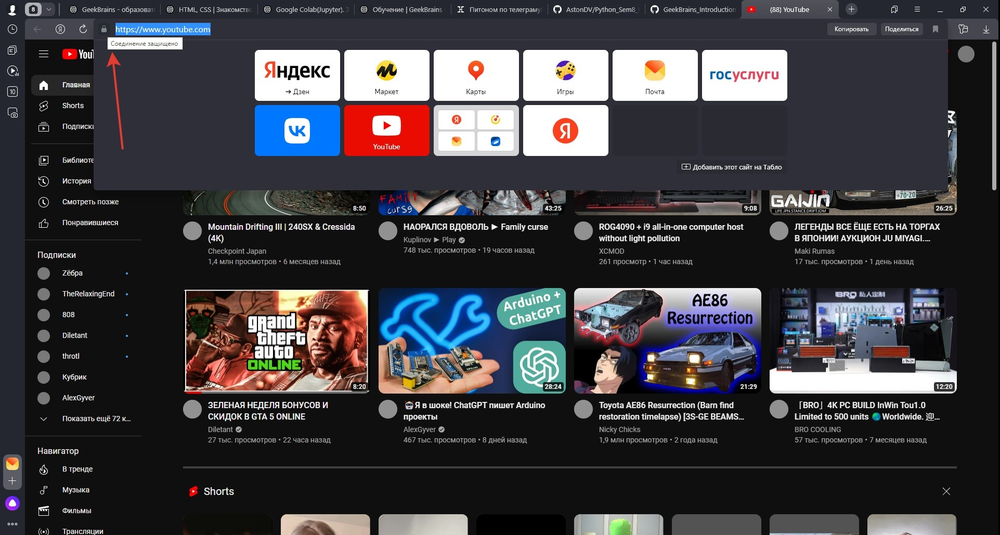
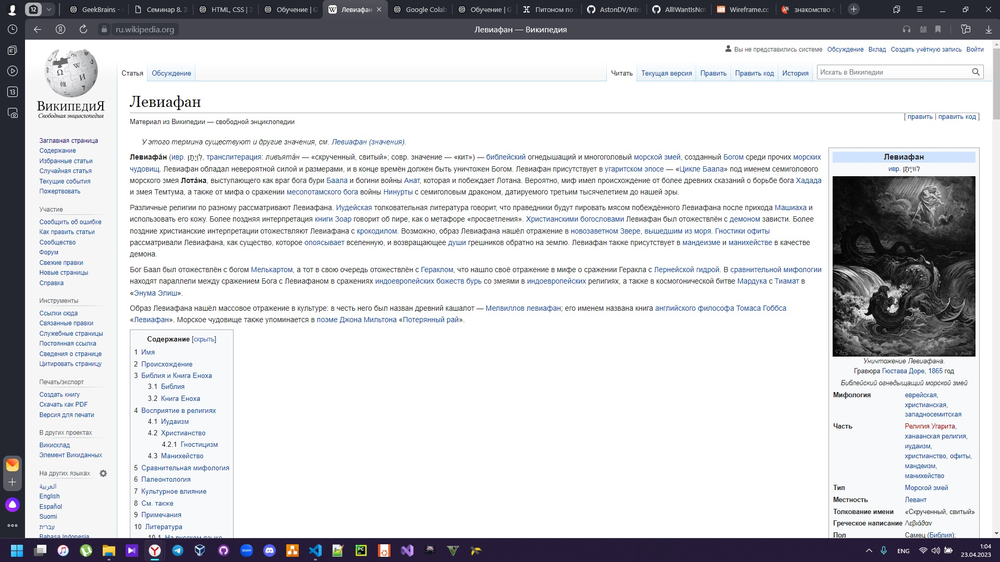
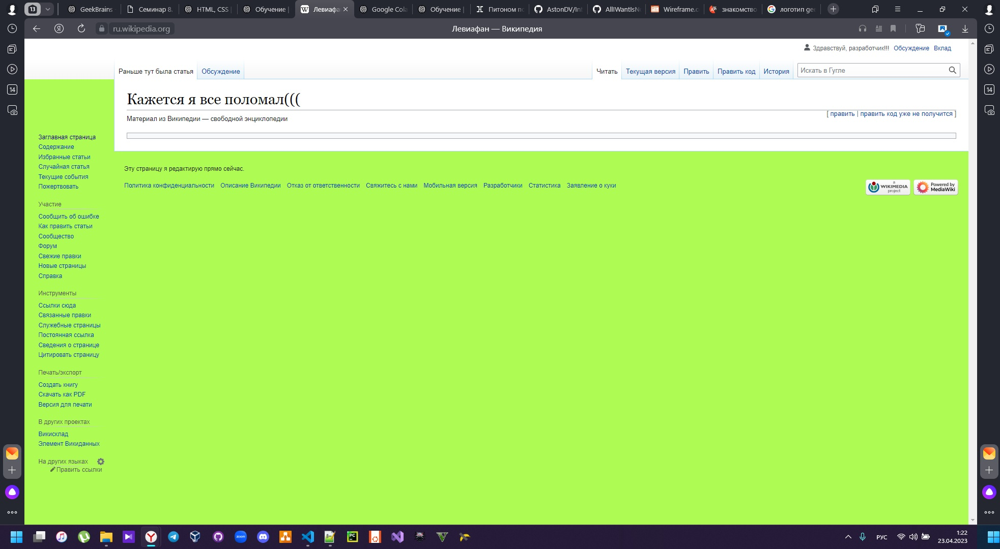
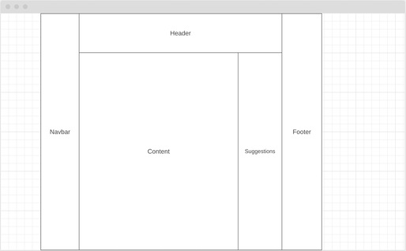

## Задача №1:
> Определите, на каком протоколе работает сайт [youtube.com](https://youtube.com)
Сайт YouTube работает на протоколе HTTPS.

## Задача №2:
> Проанализируйте структуру страницы сайта [wikipedia.org/](https://ru.wikipedia.org/), а именно нужно описать, какие блоки есть на сайте, что в этих блоках находится. Есть ли на сайте шапка, подвал, что в них содержится? Как и где расположен контент? Есть ли дополнительные элементы на странице?
Сайт представлен 4-мя основными секциями:
1. Header расположен вверху страницы, ориентирован горизонтально, содержит:
 - основные элементы управления;
 - поисковая строка;
 - аутентификация пользователя.
2. Секция navbar, расположена слева страницы, ориентирована вертикально, содержит:
 - логотип сайта;
 - основные инструменты сайта (языковые настройки и пр., пр.);
3. Content расположен в относительном центре справа, содержит:
 - контент текущего раздела сайта;
4. Footer расположен внизу страницы, ориентирован горизонтально, содержит:
 - Правила сайта;
 - Информация о разработчиках;
 - пр. информация.

## Задача №3:
> Внесите не менее 10 изменений на страницу любой статьи сайта [wikipedia.org](https://ru.wikipedia.org/), с помощью инструмента разработчика и представьте два скриншота было/стало, а также краткие пояснения, что и где было изменено. Желательно поработать с изменением текста на странице, заменой картинки, изменением стилей и видом иконок.
### Было:

### Стало:

### Изменено:
1. Удалены кнопки войти и создать учетную запись
2. Удален логотип Wikipedia
3. Удален content
4. Изменен заголовок header
5. Изменен текст footer
6. Изменена информация отсутсвия аутентификации
7. Удалены полезные ссылки из секции информации
8. Удалены языки из navbar
9. Изменена строка поиска
10. Изменен цвет фона

## Задача №4:
> Создайте прототип низкой детализации сайта [dzen.ru](https://dzen.ru/) с помощью сайта [wireframe.cc](https://wireframe.cc/). Предоставьте скриншот того, что получилось
### Низкая детализация:
